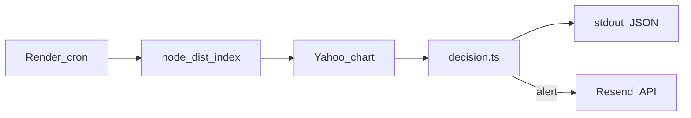

# Drawdown alert (stateless cron)

After the US cash close, a **Render cron job** pulls daily S&P closes, checks whether the index **just crossed** downward through a drawdown threshold versus its all-time high inside a rolling lookback window, and emails you when that edge fires. There is **no database** and no saved “already mailed” flag: every run recomputes everything from price history.

## Architecture

1. **Cron** — `node dist/index.js` on a weekday schedule (UTC) after the bell.
2. **Price feed** — Yahoo Finance via `yahoo-finance2` `chart()` (daily bars).
3. **Pure decision core** — [`src/decision.ts`](src/decision.ts) implements the crossing test and the “missed day” scan (see file header).
4. **Email** — Resend HTTP API when not in `--dry-run`.



Duplicate mail on the same calendar day is **accepted** by design (cheap for a personal notifier). If you need hard de-dupe later, add a Resend idempotency key.

Render’s **blueprint `free` instance type is not offered for cron jobs**; expect a small recurring charge per [Render pricing](https://render.com/pricing). Tune the `plan` in [`render.yaml`](render.yaml) to match your workspace.

## Prerequisites

- Node.js 20+
- A [Resend](https://resend.com) account plus a **verified sending domain** (or their sandbox sender for experiments)

## Setup

```bash
cp .env.example .env
# fill ALERT_EMAILS, RESEND_API_KEY, RESEND_FROM …
npm ci
npm run build
```

## Environment

| Variable | Default | Purpose |
|----------|---------|---------|
| `DRAWDOWN_THRESHOLD` | `0.05` | Crossing threshold (fraction, e.g. 5%) |
| `SYMBOL` | `^GSPC` | Yahoo Finance symbol |
| `LOOKBACK_DAYS` | `1825` | Calendar span for the Yahoo request (ATH is max over returned history) |
| `MISSED_RUN_LOOKBACK` | `3` | How many latest **trading sessions** to inspect for a missed crossing |
| `ALERT_EMAILS` | — | Comma-separated inbox list |
| `RESEND_API_KEY` | — | API token (not required with `--dry-run`) |
| `RESEND_FROM` | `onboarding@resend.dev` | Verified From address |

ATH in emails is “all-time high **within the fetched lookback**”, not since 1871. Increase `LOOKBACK_DAYS` if you need more history.

### More recipients

Append addresses to `ALERT_EMAILS`:

```bash
ALERT_EMAILS=you@example.com,partner@example.com
```

## Local runs

```bash
# Live Yahoo pull, structured logs, skips Resend / env recipients
npm run build
node dist/index.js --dry-run

# Simulate “today” for back-testing
node dist/index.js --dry-run --as-of 2020-03-20
```

`--as-of YYYY-MM-DD` keeps bars on or before that UTC calendar date (last trading session if markets were shut).

Unit tests (`npm test`) exercise [`src/decision.ts`](src/decision.ts) with synthetic series—including a focused case where `missedRunLookback: 1`, so **only** the latest session qualifies. That verifies “already below threshold yesterday ⇒ no crossing edge today” for the naive two-day view. Production uses `MISSED_RUN_LOOKBACK: 3`, so catch-up jobs can still notify if a crossing happened within the resilience window earlier in the week.

## Deploy (Render blueprint)

[`render.yaml`](render.yaml) defines a Node cron targeting `schedule: '0 22 * * 1-5'` (approx. weekday 5:30pm America/New_York depending on DST). After connecting the repo, set secret env vars in the dashboard:

- `ALERT_EMAILS`
- `RESEND_API_KEY`
- `RESEND_FROM`

The service installs dependencies and emits `dist/index.js` via `npm run build`.

Logs are JSON lines to stdout/`stderr`; failed fetches validation exit **non‑zero**.

## Swap the quote provider

1. Implement a function with the same return type as [`fetchDailyClosesYahoo`](src/providers/yahoo.ts) producing sorted [`DailyBar`](src/providers/types.ts) rows.
2. Swap the call site in [`src/index.ts`](src/index.ts).

`yahoo-finance2` stays isolated in `src/providers/yahoo.ts` for that reason.

## Development commands

```bash
npm run check   # typecheck without emit
npm run build   # emits dist/
npm test        # vitest suite
npm run dry-run # build + dry-run shorthand (ensure dist exists)
```

## Operational notes

- **Re-runs**: two launches the same calendar day both see identical history; duplicate emails after a crossing are possible (see README intro).
- **Trading calendar**: Adjacent rows are successive **sessions** Yahoo returns — weekends/exchange holidays are implicitly skipped.
- **Data warnings**: Yahoo is unofficial; watch Render logs after deploy.

## License

ISC (default `package.json`).
